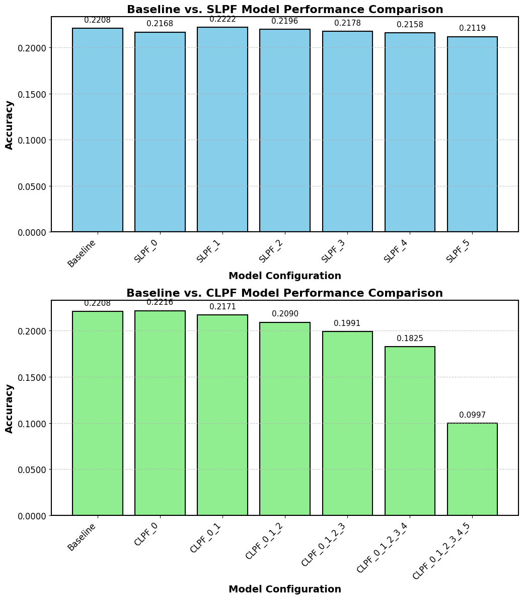

# POSLayerFreeze: Exploring Layer Freezing for POS Tagging

| {width=100} | {width=100} | {width=100} | {width=100} | {width=100} |
| --- | --- | --- | --- | --- |
| {width=100} | {width=100} | {width=100} | {width=100} | {width=100} |
**POSLayerFreeze** investigates the impact of freezing different layers of a transformer model (DistilBERT) on the task of Part-of-Speech (POS) tagging. The project focuses on understanding how freezing specific layers, both individually (Single Layer Partial Freezing or SLPF) and in combination (Compound Layer Partial Freezing or CLPF), affects the model's performance.


## Project Overview

This project uses DistilBERT for token classification on the Universal Dependencies dataset to perform POS tagging. We analyze the performance difference when certain layers of the model are frozen during training.

## Key Features
- **Baseline Model Performance**: A standard DistilBERT model trained on the POS tagging task without freezing any layers.
- **Single Layer Partial Freezing (SLPF)**: Models with only one layer frozen at a time to observe its impact on performance.
- **Compound Layer Partial Freezing (CLPF)**: Models with multiple layers frozen in various combinations to measure cumulative effects on model accuracy.
- **Visualization of Results**: A single visual comparison between baseline, SLPF, and CLPF configurations based on accuracy.

## How to Use

1. **Run the Notebook**:
   - All code for training and evaluation is contained within a single Jupyter Notebook. Open the notebook and run all cells to replicate the experiments.
   - The notebook trains the baseline model, implements both SLPF and CLPF techniques, and evaluates the model using accuracy and other metrics.

2. **View Results**:
   - The notebook generates performance metrics for each model configuration and produces visual comparisons of accuracy across different configurations.
   - The results are stored in the notebook for further analysis.

## Results

### Visualization
Below is the visualization comparing the accuracy of the baseline model against both SLPF and CLPF configurations in a single figure.



- **SLPF (Single Layer Partial Freezing)**: Freezing individual layers leads to a range of effects, with **Layer 1** showing the best performance. The rest of the frozen layers yield similar or slightly lower accuracies compared to the baseline.
  
- **CLPF (Compound Layer Partial Freezing)**: Freezing multiple layers causes more significant performance degradation. As more layers are frozen, the accuracy declines, with freezing all layers resulting in the lowest accuracy.

### Performance Metrics

- **Baseline Model Accuracy**: 22.08%
- **Best SLPF Accuracy (Layer 1 frozen)**: 22.72%
- **Best CLPF Accuracy (Layers 0 and 1 frozen)**: 22.16%
- **Worst CLPF Accuracy (All layers frozen)**: 9.97%

## Conclusion

The results demonstrate that freezing specific layers, such as **Layer 1**, can slightly enhance performance while keeping training efficient. However, freezing too many layers (as in CLPF) leads to significant performance loss, especially when freezing all layers.

## How to Replicate

1. Clone the repository:
   ```bash
   git clone https://github.com/chikap421/POSLayerFreeze.git
